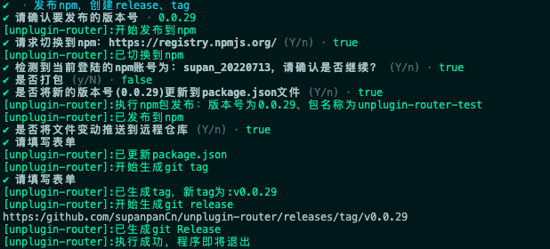

# cli-pkg

通过编程式api完成npm包的发布、git release、git tag的自动生成


## 安装

```js
yarn add cli-pkg
```

## 参数说明

 | 属性名 | 说明 | 类型 | 可选值 | 默认值 |
 | --- | --- | --- | --- | --- | 
 | runAt | 日志打印的前缀 | string | -- | cli-pkg |
 | pkgName | 设置仅当package.json中的name与此匹配时执行脚本 | string | -- | -- |
 | registry | npm包发布的地址 | string | -- | https://registry.npmjs.org/ |
 | firstCall | 调度顺序 | string | 见下 | "createTag" |
 | packageManage | 执行命令的包管理器 | string | "pnpm" | "yarn" | "cnpm" | "npm" |
 | allowedBranch | 限制执行脚本的分支 | array | -- | ["main"] |
 | ignoreGitChangeFiles | 设置跳过git clean检查的文件 | array | -- | ["yarn.lock","package-lock.json","pnpm-lock.yaml","yarn-error.log",] |


## 编程接口

- createRelease

- createTag

- publishNpm

## 生命周期

- config

- success

- before:publish

- after:publish

- before:tag

- after:tag

- before:release

- after:release

## 代码参考

在[unplugin-router](https://github.com/supanpanCn/unplugin-router)中，实现的流程为：先发布npm，再创建git tag，最后生成git release
# 演示效果



